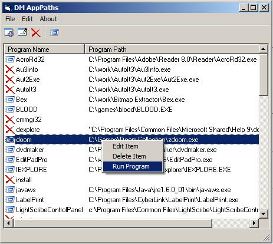



## DM AppPaths

### Description

DM AppPaths is a smll program to allow you to add and edit custom programs that can be launched. you can also edit or delete exsiting programs, and tell if a program link is found or not, anyway hope you like this code, please vote.
 
### More Info
 

             |
---                |---
**Submitted On**   |2008-11-05 13:49:04
**By**             |[dreamvb](https://github.com/Planet-Source-Code/PSCIndex/blob/master/ByAuthor/dreamvb.md)
**Level**          |Beginner
**User Rating**    |4.9 (39 globes from 8 users)
**Compatibility**  |VB 6\.0
**Category**       |[Complete Applications](https://github.com/Planet-Source-Code/PSCIndex/blob/master/ByCategory/complete-applications__1-27.md)
**World**          |[Visual Basic](https://github.com/Planet-Source-Code/PSCIndex/blob/master/ByWorld/visual-basic.md)
**Archive File**   |[DM\_AppPath2133241152008\.zip](https://github.com/Planet-Source-Code/dreamvb-dm-apppaths__1-71360/archive/master.zip)

